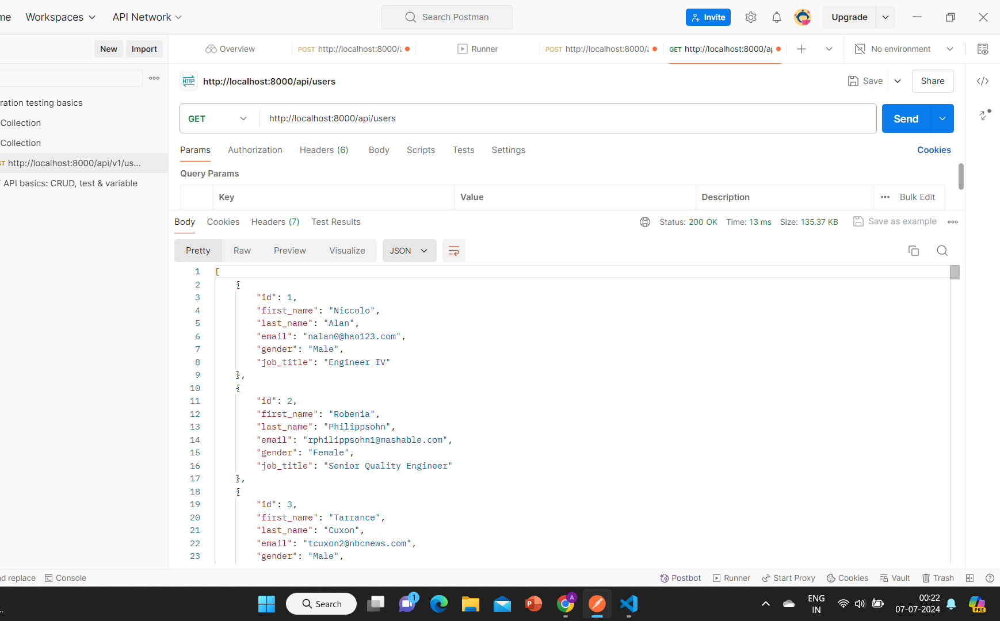
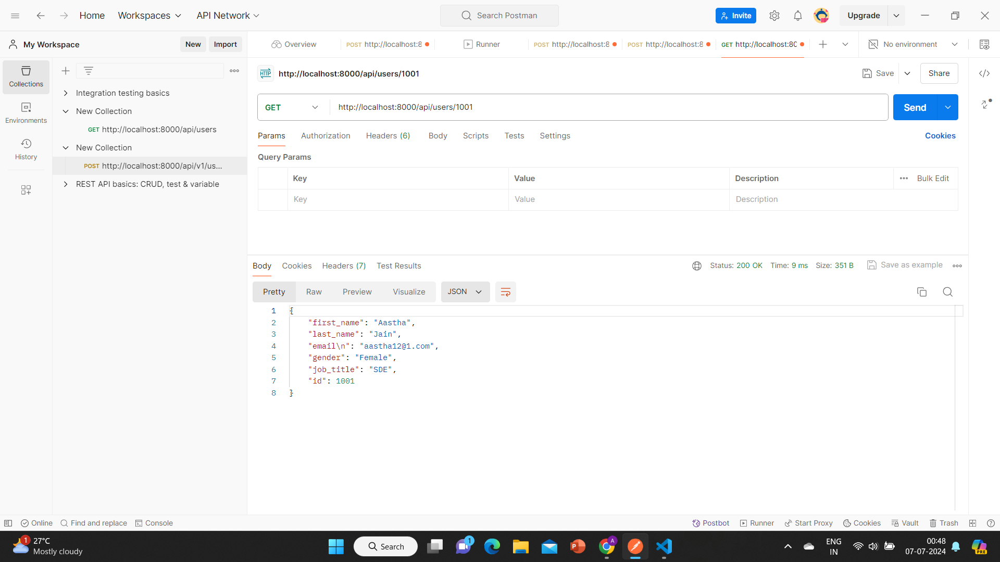
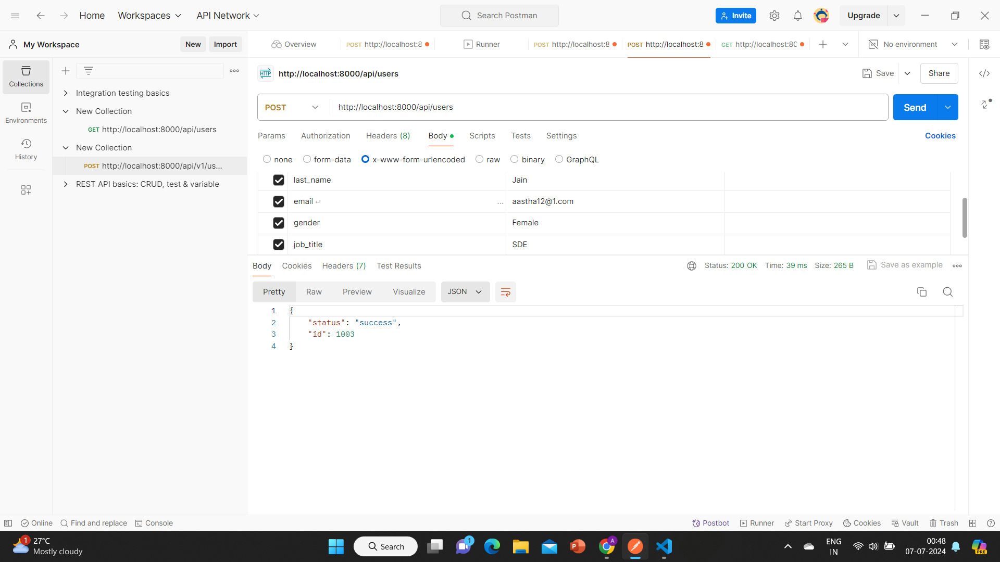
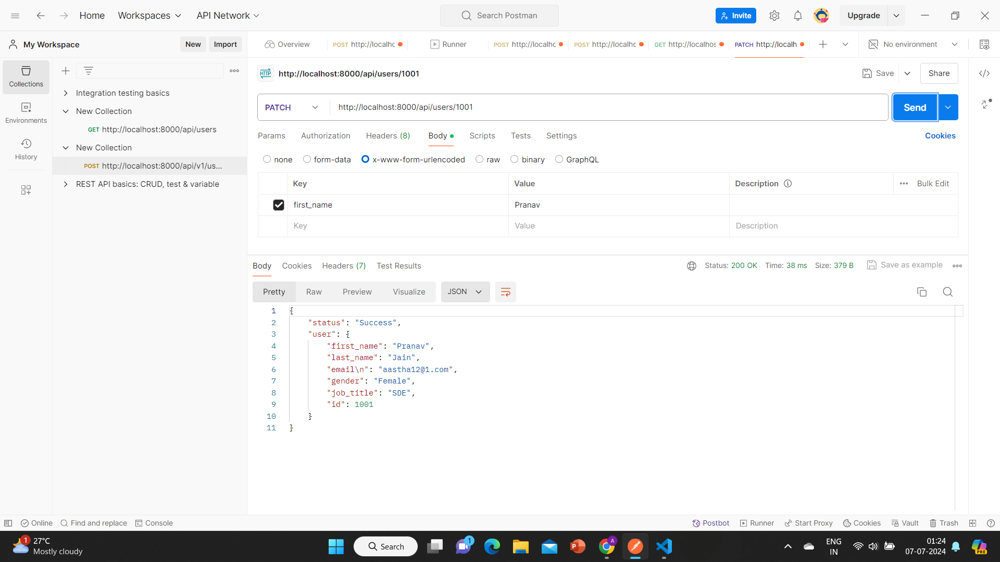
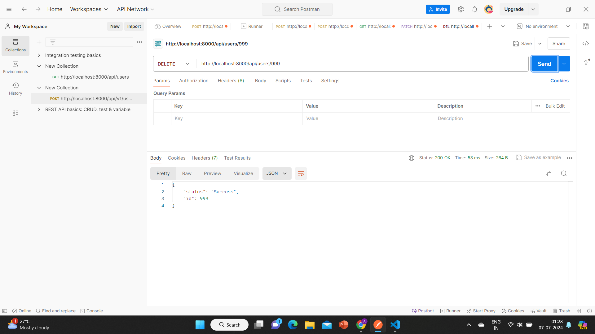

### Rest APIs using NODE and Express.js

This is a project illustrating different operations on rest api like get, patch, post and delete.

GET: To get users

PATCH: To update an existing user

POST: To create a new user

DELETE: To delete a user

### GET

1) get all users

2) get a user by id

### POST

### PATCH

### DELETE 

### Installation

Clone the repository:

git clone https://github.com/yourusername/your-repo.git

### Navigate to the project directory:

cd your-repo

### Install the dependencies:

npm install

### Running the Server

Start the server with:

npm start